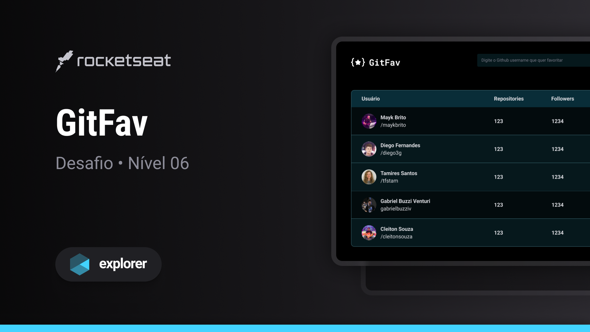

<h1 align="center">GitFav</h1>

  Projeto retirado do programa Explorer, um programa de estudo exclusivo promovido pela Rocketseat para o ensino de tecnologias web.

  <a href="#-layout">Layout</a>&nbsp;&nbsp;&nbsp;|&nbsp;&nbsp;&nbsp;
  <a href="#-aprendizado">Aprendizado</a>&nbsp;&nbsp;&nbsp;|&nbsp;&nbsp;&nbsp;
  <a href="#-projeto">Projeto</a>&nbsp;&nbsp;&nbsp;|&nbsp;&nbsp;&nbsp;
  <a href="#-tecnologias">Tecnologias</a>&nbsp;&nbsp;&nbsp;|&nbsp;&nbsp;&nbsp;
  <a href="#-licença">Licença</a>

 

  

 

  

## 🎨 Layout

Você pode visualizar o layout do projeto através [DESSE LINK](https://www.figma.com/file/SzQA07HwmSPj4hOYgu1Pps/%5BDesafios-Explorer%5D-GitFav/duplicate).

## 📖 Aprendizado

- Aprendi a utilizar uma API de forma eficaz para buscar e manipular dados externos;
- Aprofundei meu conhecimento no uso do operador spread em JavaScript;
- Adquiri proficiência na incorporação de tabelas em páginas HTML;
- Explorei o conceito de polimorfismo no JavaScript;
- Adquiri competências para lidar com exceções no JavaScript, fazendo uso das estruturas try, throw e catch de forma eficaz para gerenciar erros;
- Compreendi e utilizei funções de alta ordem (high order functions);
- Aprendi a utilizar o LocalStorage para armazenar e recuperar informações localmente.

## 💻 Projeto

O objetivo principal do projeto GitFav era aproveitar a API do GitHub para desenvolver uma funcionalidade que permitisse aos usuários do GitHub marcar outros usuários como seus favoritos e exibir essas informações em forma de tabela.

## 🧪 Tecnologias

Esse projeto foi desenvolvido com as seguintes tecnologias:

- [HTML](https://developer.mozilla.org/pt-BR/docs/Web/HTML)
- [JavaScript](https://developer.mozilla.org/pt-BR/docs/Web/JavaScript)
- [Tailwind CSS](https://tailwindcss.com)
- [Prettier](https://prettier.io)

## 📝 Licença

Este projeto está sob a licença MIT. Consulte o arquivo [LICENSE](https://github.com/kauankarvalho/GitFav/blob/main/LICENSE) para obter mais detalhes.
